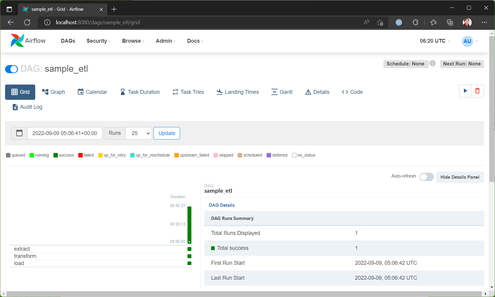
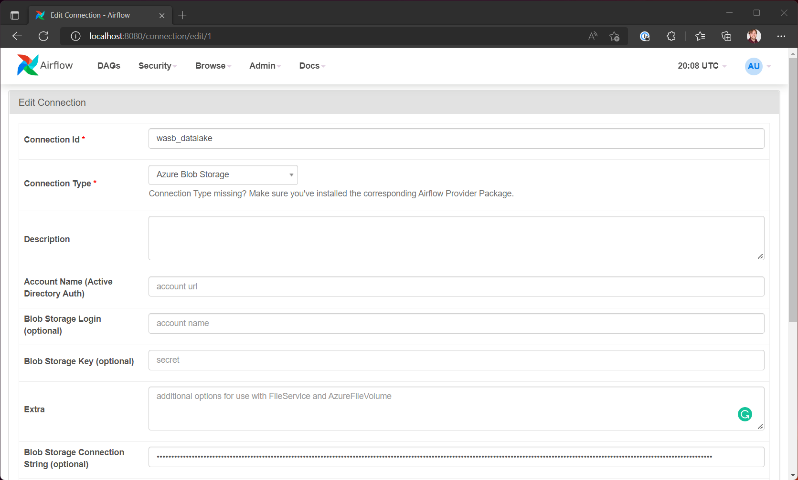
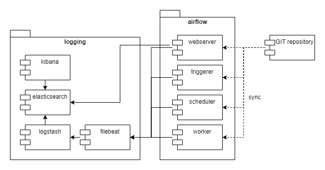

# MLOps environment with Airflow, MLFlow, and KServe



This repository contains a fully deployable environment for doing MLOps with 
Apache Airflow, MLFlow, and KServe.

## System requirements

We assume that you have the following:

- Access to a Kubernetes 1.22+ cluster with at least 4 CPU cores and 20Gb
- The latest release of Anaconda on your machine
- Kubectl must be installed on your machine
- Helm 3 or higher installed on your machine
- Istio 1.11.6

Please note, this sample only works on WSL2 or Linux!

## Deploying the sample

For the sample to work, you'll need to configure a set of things on top
of Kubernetes. Please follow the instructions in the following sections to
set things up.

We recommend that you use a cluster that's capable of hosting loadbalancer
services. Some commands assume that you'll use external IP-addresses and
this can't be done with a loadbalancer setup in Kubernetes.

### Installing Istio

The sample uses Istio to route traffic from outside the cluster and to support
canary releasing models. Please use the following command to install Istio:

```
istioctl install -y
```

### Deploying KServe

The model serving environment is implemented using KServe. The KServe tool
allows use to host models with a serverless philosophy. You can install KServe
using the following script: 

```shell
./install-kserve.sh
```

Please note, you'll need to set up a host entry in your host file for the 
KNative installation to work. You can get the external IP-address for your
cluster using the following command:

```shell
kubectl --namespace istio-system get service istio-ingressgateway
```

Add the following entry to your host file:

```text
<ip-address>    knative.mlopsdemo.local
```

Once you've configured the environment, you can access it on the URL you
just configured in the host file.

--------------------------------------------------------------------------------

Please note, you may get errors regarding cert manager not being able to service
a certificate request. This happens when cert manager isn't ready yet. You can
re-run the `./install-kserve.sh` script after a few minutes and it should work
as intended.

--------------------------------------------------------------------------------

### Deploying airflow

We're using Helm to deploy the airflow components to the Kubernetes cluster.
You'll need to perform a few preparation steps before deploying the 
components to the Kubernetes cluster.

Create a new file `deploy/airflow/values-secrets.yml` and add the following
content to it:

```yaml
extraSecrets:
  airflow-ssh-secret:
    data: |
      gitSshKey: '<your-key>'
webserverSecretKey: <random-string>
defaultUser.password: <your-password>
data:
  metadataConnection:
    user: postgres
    pass: <your-password>
```

Make sure you replace the `<your-key>` value with the base64 encoded version
of an SSH private key that has access to the repo you want to sync with airflow.

You can encode your key using the following command from WSL2:

```shell
base64 <your-key-file> -w 0 > temp.txt
```

You can grab the encoded key from `temp.txt`. Ensure a strong password for the 
admin account and a strong password for the database.

You'll also need to specify the secret for signing web sessions with the airflow
webserver. We recommend generating a GUID or another random string for this
secret value.

After completing the secrets, edit the file `deploy/airflow/values-override.yml`
and configure the URL of the GIT repo, the branch name, and the revision you
want to sync.

Once you've configured the values, run the following command to install 
Airflow:

```shell
kubectl create namespace airflow
./deploy-airflow.sh
```

It will take a few minutes to deploy the airflow components.

### Deploying MLFlow

In addition to Airflow, we're going to use a tracking solution for ML models. 
MLFlow is an open-source tool that allows you to track experiments and trained
models. 

Add a new file `secrets.yml` to the folder `./deploy/mlflow` and add the
following content to it:

```yaml
apiVersion: v1
kind: Secret
metadata:
  name: mlflow-secrets
type: Opaque
data:
  databasePassword: <your-password> 
```

Replace `<your-password>` with a base64-encoded password of your choice. Save
the file when you're done.

Use the following command in your terminal to deploy MLFlow:

```shell
./deploy-mlflow.sh
```

### Deploying logging components

We've included logging through the ELK stack in the sample. You can deploy the
components needed for logging using the following command:

```shell
./deploy-elasticsearch.sh
```

It will take a few minutes for the logging components to come online. Once
they're ready and you run a DAG, the logs
will show up in elasticsearch. You can access them as normal in the Apache
Airflow UI.

## Working with the sample

This section covers how to work with the sample in your own environment.

### Configuring your machine

As with many Python projects, you'll need a virtual environment of some sort.
We recommend that you use anaconda since it features a lot of the packages
you'll need for data science.

You can create a new Anaconda environment using the following command:

```shell
conda create -n mlopsdemo python=3.7
```

This command creates an environment that matches the Python version used by 
Airflow. 

After creating the Anaconda environment, run the following command to install
the project dependencies:

```shell
pip install -r requirements.txt
```

### Configuring the connection to a datalake

We're using Azure blob storage with hierarchical namespaces as a data lake in
the sample. To access the data lake, you'll need to set up a connection in the
UI.



If you're running on Azure, and you have managed identity set up for your 
Kubernetes cluster, you can choose to set an account name. For the purposes
of the sample, we recommend setting the Blob Storage Connection String instead.

Make sure to name the connection `wasb_datalake`. This is preconfigured in the
tasks in the sample pipeline.

In the configured storage account, you'll need the following containers:

* `raw` - This is where you need to store the raw dataset.
* `intermediate` - This is where intermediate resuls are stored.
* `preprocessed` - This is where the preprocessed data is stored.

You can get the sample dataset from [this website][DATASET_URL]. Upload it to
the `raw` container in the folder `wachttijden/2022/09/09/`. Make sure you
rename the file to `wachttijden.csv`.

### Making changes to pipelines

When you've deployed all the components to your Kubernetes environment. You can
start building a pipeline. 

We've included a sample in the folder `src/pipelines`. This folder is
automatically synced from the linked GIT repository.

Every time you push a change to your linked GIT repository, the changes are
picked up by the Airflow instance.

### Starting pipelines

We've used a manual schedule for each pipeline in the sample. You'll need to
login to the airflow instance to start the pipelines. 

First, you'll need to start a port-forward to the Airflow instance. Use the 
following command to start the port-forward:

```shell
kubectl port-forward -n airflow svc/airflow-webserver 8080:8080
``` 

After starting the port-forward, navigate to `http://localhost:8080` and log in
using the username `admin` and the password you configured during deployment.

You can now start the pipelines from the user interface.

### Running tests

In the `src/tests` folder you'll find a couple of unit-tests for various parts
of the pipeline steps. You can run the tests using the following command:

```shell
AIRFLOW__CORE__DAGS_FOLDER=./src/pipelines python -m pytest -s ./src/
```

This command configures airflow so it loads the folder `src/pipelines` and then
starts pytest from the `src/` folder. 

### Debugging pipelines

This project includes a launch configuration for VSCode. You can find it in
`.vscode/launch.json`. Please make sure you set the correct path for the
`program` argument so it points to the location of the airflow executable.

## Documentation

This section describes various design choices in the sample. You can use this if
you're looking to bring the ideas from this sample into your own project.

### Runtime view

This section covers the key runtime scenario's for the sample.

#### How DAGs are executed

Whenever you run a DAG, the Airflow scheduler will use the Kubernetes executor
to run the individual tasks in the DAG. Tasks don't exchange data, but they can
exchange metadata such as the location of an output file or input file.

Log files generated by a task are collected through filebeat and sent to
logstash. Logstash enriches the incoming log data with extra fields needed by
Airflow to display the log in the user interface. After enriching the data,
Logstash forwards the data to elastic search.

#### How DAGs are deployed

There are a few options to get DAGs into the Airflow environment. We've 
choosen to link Airflow to a GIT repository. You're looking at the linked GIT
repository right now. 

Whenever you commit and push files to GIT, the repository is synced with the
Airflow environment. Please note, it will take up to a minute for the
environment to detect the new and modified DAGs.

### Deployment architecture

This sample contains a pretty large number of moving parts. In this section
we'll cover how these parts work together inside the Kubernetes cluster.



After deploying all the components you'll have two namespaces on your
Kubernetes cluster:

| Namespace | Description                                        |
|-----------|----------------------------------------------------|
| airflow   | Contains all components related to Apache Airflow. |
| logging   | Contains all logging components.                   |

#### Airflow components

* webserver - Hosts the UI and the REST API.
* scheduler - Schedules DAGs and monitors progress.
* worker - Each task is deployed as a worker pod in the cluster.
* triggerer - Processes DAG triggers.

#### Logging components

* kibana - Dashboarding tool for elasticsearch.
* elasticsearch - Stores logging data.
* logstash - Enriches data before pushing it to elasticsearch.
* filebeat - Scrapes log data from the airflow components.

#### Machine learning components

* mlflow - Tracking of model training runs and stores registered models

[DATASET_URL]: https://puc.overheid.nl/PUC/Handlers/DownloadDocument.ashx?identifier=PUC_656543_22&versienummer=1
